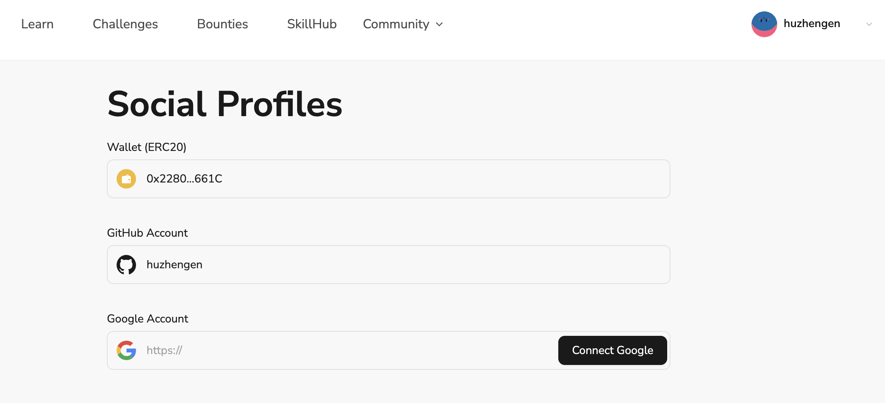

# Task2 Blockchain Basic

本任务分为简答题、分析题和选择题，以此为模板，在下方填写你的答案即可。

选择题，请在你选中的项目中，将 `[ ]` 改为 `[x]` 即可

## [单选题] 如果你莫名奇妙收到了一个 NFT，那么

- [ ] 天上掉米，我应该马上点开他的链接
- [x] 这可能是在对我进行诈骗！

## [单选题] 群里大哥给我发的网站，说能赚大米，我应该

- [ ] 赶紧冲啊，待会米被人抢了
- [x] 谨慎判断，不在不信任的网站链接钱包

## [单选题] 下列说法正确的是

- [ ] 一个私钥对应一个地址
- [x] 一个私钥对应多个地址
- [ ] 多个私钥对应一个地址
- [ ] 多个私钥对应多个地址

## [单选题] 下列哪个是以太坊虚拟机的简称

- [ ] CLR
- [x] EVM
- [ ] JVM

## [单选题] 以下哪个是以太坊上正确的地址格式？

- [ ] 1A4BHoT2sXFuHsyL6bnTcD1m6AP9C5uyT1
- [ ] TEEuMMSc6zPJD36gfjBAR2GmqT6Tu1Rcut
- [ ] 0x997fd71a4cf5d214009619808176b947aec122890a7fcee02e78e329596c94ba
- [x] 0xf39Fd6e51aad88F6F4ce6aB8827279cffFb92266

## [多选题] 有一天某个大哥说要按市场价的 80% 出油给你，有可能

- [x] 他在洗米
- [ ] 他良心发现
- [x] 要给我黒米
- [x] 给我下套呢

## [多选题] 以下哪些是以太坊的二层扩容方案？

- [ ] Lightning Network（闪电网络）
- [x] Optimsitic Rollup
- [x] Zk Rollup

## [简答题] 简述区块链的网络结构

```
区块链的网络结构是去中心化的，由对等节点组成，节点通过协议进行通信和共识，数据分布式存储在节点上。
```

## [简答题] 智能合约是什么，有何作用？

```
智能合约是一种在区块链上执行的自动化合约，它是以编程代码的形式存在，并能够自动执行合约条款和条件。

智能合约的作用是在没有中间人的情况下，通过编程方式加强和执行合约的条款和条件。
```

## [简答题] 怎么理解大家常说的 `EVM` 这个词汇？

```
`EVM` 是以太坊虚拟机（Ethereum Virtual Machine）的缩写，它是以太坊网络的核心组件之一。EVM 是一个基于堆栈的虚拟机，用于在以太坊区块链上执行智能合约的字节码。
```

## [分析题] 你对去中心化的理解

```
我认为去中心化是不依赖于单一的中心权威机构，而是由多个自治的节点或参与者共同管理和决策的。
```

## [分析题] 比较区块链与传统数据库，你的看法？

```
1. 区块链是去中心化，分布式的；传统数据库主要依赖于中心化的服务器。

2. 区块链采用分布式账本的数据模型，数据以块的形式链接在一起，形成不可篡改的链式结构；传统数据库采用表格的数据模型，数据以行和列的形式组织在表中。
```

## 操作题

安装一个 WEB3 钱包，创建账户后与 [openbuild.xyz](https://openbuild.xyz/profile) 进行绑定，截图后文件命名为 `./bind-wallet.jpg`.

